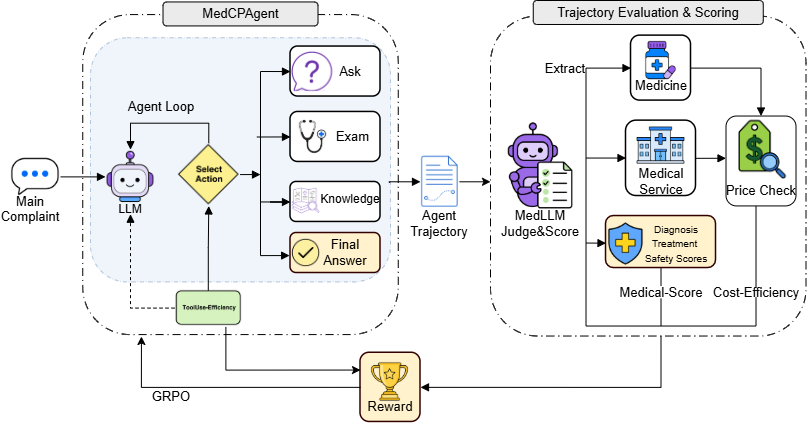

# MedCPEnv

面向医疗智能体评测与 Agentic RL 的模拟医院环境。



上图展示了 MedCPEnv 的整体流程：智能体围绕主诉进行问诊、检查和知识检索，生成 trajectory 后，再进入评测、打分与 reward 计算环节。

MedCPEnv 用于研究和训练 LLM 在模拟医院场景中的决策能力。项目把问诊、检查、知识检索等能力封装成统一的 tooluse 接口，并配套合成病例、评测器、成本统计和训练脚本，方便做 benchmark、对比实验和强化学习训练。

> 本项目仅用于研究、评测与模拟训练，不用于真实临床诊疗。

## 项目特点

- 统一的医疗工具层，覆盖 `ASK`、`EXAM`、`KNOWLEDGE` 等交互
- 基于合成病例的可控环境，便于重复实验和横向比较
- 支持诊断、治疗、安全性、效率与成本等多维评估
- 提供 benchmark、rejudge、雷达图和训练脚本
- 兼容本地部署模型与 OpenAI 兼容接口

## 快速开始

### 安装依赖

```bash
pip install -r requirements.txt
```

## 数据集

项目相关数据已发布在 Hugging Face：

- [skylenage/MedCPEnv-Dataset](https://huggingface.co/datasets/skylenage/MedCPEnv-Dataset)

### 配置环境变量

按需配置对应的模型 API Key。常见变量名可参考 `src/README.md` 和 `scripts/README.md`，例如：

```bash
export BAICHUAN_API_KEY="sk-xxx"
export DASHSCOPE_API_KEY_CP="sk-xxx"
```

### 常用命令

```bash
# 运行基准评测
python exp/benchmark.py --all --n 1000 --max-workers 5

# 重新评分已有结果
python exp/rejudge.py --n 1000

# 生成雷达图
python exp/plot_radar.py

# 启动 Agentic RL 训练
bash scripts/agentic_rl.sh
```

## 强化学习训练

项目支持基于 TRL GRPO 的医疗 Agent 强化学习训练。训练目标主要包括：

- 合理使用 `ASK`、`EXAM`、`KNOWLEDGE` 工具
- 提高诊断和治疗建议的正确性
- 降低对医疗禁忌的违反
- 控制工具调用次数，并保持输出格式稳定

### 训练流程

1. 安装依赖并配置好模型 API Key。
2. 准备训练数据与知识数据，确保评测所需服务可用。
3. 先跑一次单模型训练，确认输出和 reward 曲线正常。
4. 再使用一键脚本批量跑不同 reward 组合，做对比实验。
5. 训练完成后，用评测流程检查诊断、治疗、安全性和成本表现。

### 训练示例

```bash
# 默认训练
python scripts/agentic_rl.py

# 指定模型并启用 LoRA
python scripts/agentic_rl.py \
  --model Qwen/Qwen2.5-3B \
  --use-lora \
  --lora-r 16

# 一键运行多组训练实验
bash scripts/agentic_rl.sh
```

### 奖励设计

- `correctness_reward`：诊断与治疗正确性
- `avoid_violation_reward`：医疗禁忌约束
- `tool_usage_reward`：工具使用效率
- `structure_reward`：输出格式约束

## 核心能力

### 统一工具层

智能体通过固定动作空间与环境交互，主要包括：

- `ASK`：获取患者主观信息
- `EXAM`：获取患者客观信息
- `KNOWLEDGE`：检索医学知识
- `FINAL`：输出最终诊断与治疗建议

### 评测与分析

项目内置诊断、治疗与安全性评测，并支持效率、token、延迟和成本统计，便于分析不同模型在医疗任务中的行为差异。

### 训练与实验

仓库提供多种训练和评测脚本，可用于：

- 本地模型测试
- 多模型 benchmark
- Agentic RL 训练
- 结果汇总与可视化
